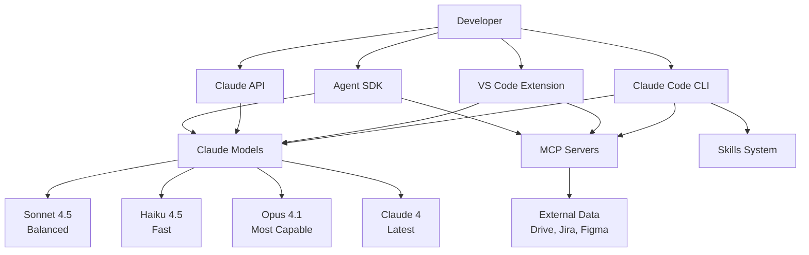
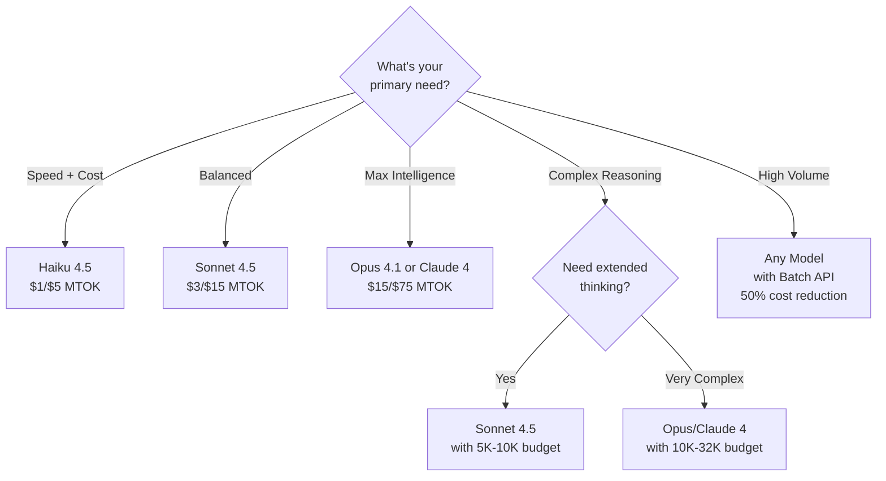
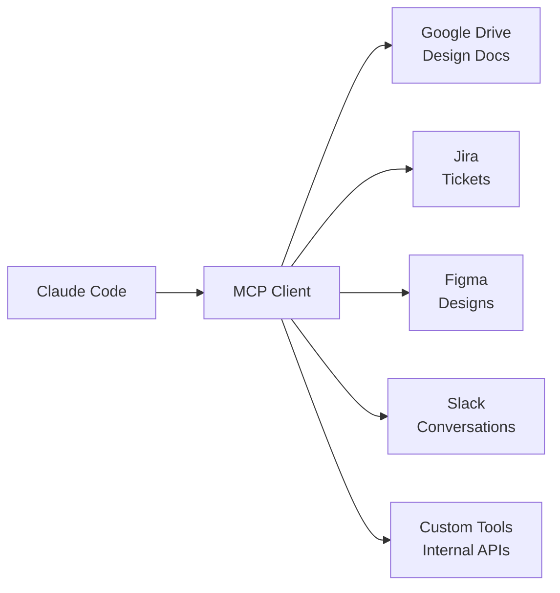
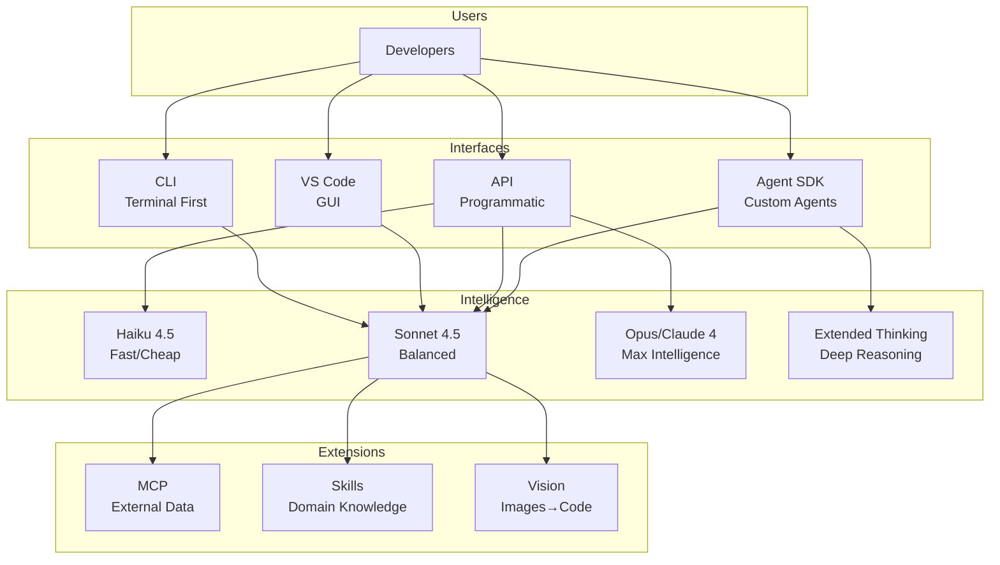

# Section 1: Mental Models & Architecture

## Understanding Claude's Ecosystem

Claude offers multiple tools and interfaces for different use cases. Understanding the architecture helps you choose the right tool for each task.



---

## 1.1 Model Family Overview

### Active Models (December 2025)

| Model | Best For | Speed | Cost (Input/Output per MTOK) | Context Window |
|-------|----------|-------|------------------------------|----------------|
| **Claude 4** | Latest, most advanced | Moderate | $15 / $75 | 200K |
| **Sonnet 4.5** | **Daily coding (recommended)** | Fast | $3 / $15 | 200K |
| **Haiku 4.5** | Speed + cost optimization | Fastest | $1 / $5 | 200K |
| **Opus 4.1** | Complex reasoning, architecture | Moderate | $15 / $75 | 200K |

**All models support:**
- ✅ Extended thinking
- ✅ Vision (text + image input)
- ✅ Tool use / function calling
- ✅ Batch processing (2M tokens)
- ✅ Prompt caching
- ✅ Multilingual capabilities

### Model Selection Decision Tree



### When to Use Each Model

**Haiku 4.5** - Speed & Cost Priority
- Quick code completions
- Simple refactoring
- Documentation generation
- High-volume API calls
- Real-time chat interactions
- **Cost:** ~10x cheaper than Opus

**Sonnet 4.5** - Daily Workhorse (Recommended)
- Feature development
- Code review
- Bug fixes and debugging
- Test generation
- API design
- **Sweet spot:** 4x faster than Opus, nearly as capable

**Opus 4.1 / Claude 4** - Complex Tasks
- System architecture design
- Complex algorithm implementation
- Security analysis
- Multi-step reasoning
- Research and analysis
- **Use sparingly:** Most expensive, but most capable

---

## 1.2 Tool Selection Matrix

### Claude Code CLI vs API vs Agent SDK vs VS Code

| Feature | CLI | API | Agent SDK | VS Code Ext |
|---------|-----|-----|-----------|-------------|
| **Interactive use** | ✅ Excellent | ❌ No | ❌ No | ✅ Excellent |
| **Automation** | ✅ Scriptable | ✅ Programmatic | ✅ Full control | ⚠️ Limited |
| **CI/CD integration** | ✅ Perfect | ✅ Perfect | ✅ Perfect | ❌ No |
| **Visual feedback** | ⚠️ Terminal only | ❌ No | ❌ No | ✅ Rich UI |
| **Custom agents** | ❌ No | ⚠️ Limited | ✅ Full control | ❌ No |
| **Piping/composition** | ✅ Unix style | ❌ No | ⚠️ Programmatic | ❌ No |
| **Learning curve** | Low | Medium | High | Lowest |
| **Flexibility** | Medium | High | Highest | Low |

### Decision Matrix: Which Tool to Use?

**Use Claude Code CLI when:**
- ✅ Working in terminal primarily
- ✅ Need to pipe command outputs
- ✅ Automating workflows (scripts, hooks)
- ✅ CI/CD integration
- ✅ Quick interactive questions
- ✅ Team uses terminal-based workflows

**Use Claude API when:**
- ✅ Building applications with AI features
- ✅ Need programmatic control
- ✅ Integrating into existing systems
- ✅ Custom UI requirements
- ✅ High-volume processing (batches)
- ✅ Need fine-grained control over requests

**Use Agent SDK when:**
- ✅ Building custom autonomous agents
- ✅ Need multi-agent orchestration
- ✅ Require custom tool integration
- ✅ Complex workflow automation
- ✅ Advanced permission control
- ✅ Subagent patterns

**Use VS Code Extension when:**
- ✅ Prefer GUI over terminal
- ✅ Visual coding feedback needed
- ✅ Not comfortable with CLI
- ✅ Occasional AI assistance
- ✅ Beginner-friendly interface

---

## 1.3 Extended Thinking Architecture

Extended thinking allows Claude to "think through" complex problems before responding, dramatically improving quality for reasoning-heavy tasks.

### How Extended Thinking Works

1. **User sends request** with `thinking: {type: "enabled", budget_tokens: 5000}`
2. **Claude reasons internally** (uses budget tokens)
3. **Thinking process visible** in response (optional: summarized)
4. **Final answer generated** based on reasoning

### Budget Token Guide

| Budget | Use Case | Example Tasks |
|--------|----------|---------------|
| **1K-2K** | Simple reasoning | Basic calculations, straightforward logic |
| **2K-5K** | Moderate complexity | Code review, refactoring planning |
| **5K-10K** | Complex analysis | Architecture design, complex debugging |
| **10K-32K** | Deep reasoning | System design, multi-step analysis |
| **32K+** | Research-level | Use Batch API (can timeout on standard) |

### Extended Thinking Example (API)

```typescript
import Anthropic from "@anthropic-ai/sdk";

const client = new Anthropic({
  apiKey: process.env.ANTHROPIC_API_KEY,
});

const message = await client.messages.create({
  model: "claude-sonnet-4-5",
  max_tokens: 16000,
  thinking: {
    type: "enabled",
    budget_tokens: 10000, // Allocate thinking budget
  },
  messages: [
    {
      role: "user",
      content: "Design a scalable microservices architecture for an e-commerce platform",
    },
  ],
});

// Response includes thinking blocks + final answer
console.log(message.content);
```

### When to Use Extended Thinking

✅ **Use extended thinking for:**
- Architecture and system design decisions
- Complex algorithmic problems
- Multi-step reasoning tasks
- Security analysis and threat modeling
- Code refactoring strategies
- Research and analysis

❌ **Don't use extended thinking for:**
- Simple code completions
- Quick documentation
- Straightforward refactors
- High-volume batch operations (adds cost)
- Real-time chat (adds latency)

### Cost Impact

Extended thinking uses **output tokens** for the thinking process:
- Thinking tokens are billed as output tokens
- Example: 5K thinking budget = up to 5K output tokens used for reasoning
- **Tip:** Start with 2K budget, increase if needed

---

## 1.4 Vision Capabilities

All current Claude models support vision (text + image input), enabling powerful code generation from visual inputs.

### Vision Use Cases for Developers

1. **Screenshot to Code**
   - UI mockups → React/Vue components
   - Wireframes → HTML/CSS
   - Design files → implementation

2. **Diagram Analysis**
   - Architecture diagrams → implementation guidance
   - Flow charts → code logic
   - Database schemas → migrations

3. **Form Understanding**
   - PDF forms → data extraction
   - Document layouts → parsing logic
   - UI screenshots → test automation

### Vision API Example

```python
import anthropic
import base64

client = anthropic.Anthropic()

# Read image file
with open("mockup.png", "rb") as image_file:
    image_data = base64.standard_b64encode(image_file.read()).decode("utf-8")

message = client.messages.create(
    model="claude-sonnet-4-5",
    max_tokens=4096,
    messages=[
        {
            "role": "user",
            "content": [
                {
                    "type": "image",
                    "source": {
                        "type": "base64",
                        "media_type": "image/png",
                        "data": image_data,
                    },
                },
                {
                    "type": "text",
                    "text": "Convert this UI mockup to React components with Tailwind CSS"
                }
            ],
        }
    ],
)

print(message.content)
```

---

## 1.5 Model Context Protocol (MCP)

MCP enables Claude to connect to external datasources and tools, dramatically expanding its capabilities beyond just code analysis.

### MCP Architecture



### Common MCP Integrations

| MCP Server | Use Case | Benefit |
|------------|----------|---------|
| **Google Drive** | Access design docs, specs | Real-time context from docs |
| **Jira** | Create/update tickets | Automated issue tracking |
| **Figma** | Read design files | Design-to-code workflows |
| **Slack** | Search conversations | Team knowledge access |
| **GitHub** | Repo analysis | Deep codebase understanding |
| **Custom** | Internal tools | Extend capabilities |

### MCP Configuration Example

```json
// .claude/mcp_config.json
{
  "mcpServers": {
    "gdrive": {
      "command": "mcp-server-gdrive",
      "args": ["--auth", "${GOOGLE_OAUTH_TOKEN}"]
    },
    "jira": {
      "command": "mcp-server-jira",
      "args": ["--url", "https://company.atlassian.net"],
      "env": {
        "JIRA_API_TOKEN": "${JIRA_TOKEN}"
      }
    }
  }
}
```

---

## 1.6 Skills System

The Skills system provides just-in-time knowledge loading, enabling Claude to access specialized domain knowledge without bloating the context window.

### Skills Architecture

**Progressive Disclosure Model:**
1. **Metadata** - Lightweight discoverability
2. **SKILL.md** - Core instructions loaded on-demand
3. **Resources** - Scripts, references, assets loaded if needed

### Skills vs. Regular Prompts

| Aspect | Regular Prompt | Skill |
|--------|---------------|-------|
| **Reusability** | One-time use | Reusable across projects |
| **Context efficiency** | Always in context | Loaded on-demand |
| **Distribution** | Copy-paste | Plugin marketplace |
| **Versioning** | Manual | Git-based |
| **Team sharing** | Manual | Automatic (marketplace) |

### Example: Security Review Skill

```markdown
---
name: security-review
description: Comprehensive security vulnerability analysis
allowed-tools: Read, Grep
model: sonnet
---

# Security Review Skill

Perform comprehensive security review checking for:

**Common Vulnerabilities:**
- SQL injection risks
- Cross-site scripting (XSS)
- Authentication/authorization issues
- Insecure data handling
- Hardcoded secrets

**For each issue:**
1. File and line number
2. Severity (Critical/High/Medium/Low)
3. Description
4. Recommended fix

Prioritize by severity.
```

**Usage:**
```bash
claude "/security-review"
```

---

## 1.7 Context Windows & Token Management

Understanding context windows helps you optimize costs and performance.

### Context Window Sizes

| Mode | Size | Use Case |
|------|------|----------|
| **Standard** | 200K tokens | Most development tasks |
| **Batch** | 2M tokens | Full codebase analysis |

**Token Usage Guide:**
- Average code file: 500-2000 tokens
- Large file (1000 lines): ~3000-5000 tokens
- CLAUDE.md (recommended): <5000 tokens

### Prompt Caching (Cost Optimization)

**Save 90% on repeated context:**
- Cache common context (CLAUDE.md, dependencies)
- First call: Full price
- Cached calls: 10% price

```typescript
const message = await client.messages.create({
  model: "claude-sonnet-4-5",
  max_tokens: 1024,
  system: [
    {
      type: "text",
      text: "Project context...", // This gets cached
      cache_control: { type: "ephemeral" }
    }
  ],
  messages: [{ role: "user", content: "Question..." }],
});
```

---

## 1.8 Mental Model Summary

### The Claude Ecosystem in One Picture



### Key Principles

1. **Choose the right tool:** CLI for automation, API for integration, SDK for agents
2. **Choose the right model:** Haiku for speed, Sonnet for balance, Opus for complexity
3. **Use extended thinking:** For complex reasoning (5K-10K budget typical)
4. **Leverage prompt caching:** Save 90% on repeated context
5. **Use MCP:** Connect to external data and tools
6. **Create skills:** Reusable domain knowledge
7. **Vision for UI:** Screenshots → code

---

## Quick Reference: Common Scenarios

| Scenario | Tool | Model | Features |
|----------|------|-------|----------|
| Daily feature development | CLI | Sonnet 4.5 | Standard context |
| Architecture design | CLI/API | Opus 4.1 | Extended thinking 10K |
| High-volume API calls | API | Haiku 4.5 | Batch processing |
| Screenshot to code | CLI/API | Sonnet 4.5 | Vision |
| Custom automation | Agent SDK | Sonnet 4.5 | Custom tools |
| CI/CD integration | CLI | Haiku 4.5 | Non-interactive |
| Complex debugging | CLI | Sonnet 4.5 | Extended thinking 5K |
| Full repo analysis | API | Sonnet 4.5 | Batch (2M context) |

---

[← Back to Part 1 Index](README) | [Next: Environment & Project Setup →](02-environment-setup)


