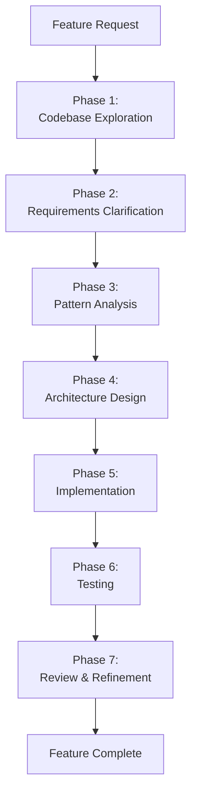
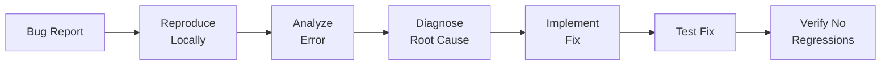
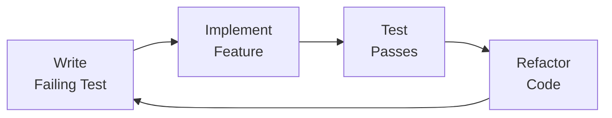
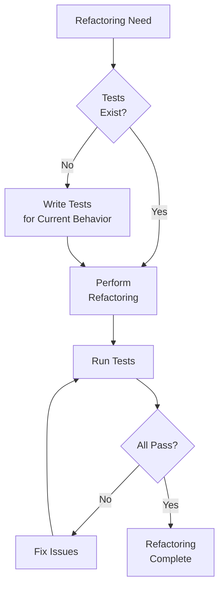

# Section 3: Core Workflows

Essential development patterns for daily work with Claude Code. These workflows are applicable whether you're using CLI, API, or Agent SDK.

---

## 3.1 The 7-Phase Feature Development Workflow

Claude Code's systematic approach to building features ensures quality and maintainability.



### Phase 1: Codebase Exploration

**Objective:** Understand existing code patterns before implementing.

**CLI Commands:**
```bash
# Explore related features
claude "Show me how authentication is currently implemented"

# Find similar patterns
claude "Find examples of API endpoints that use pagination"

# Understand architecture
claude "Explain the database layer architecture in this project"
```

**What Claude does:**
- Searches codebase for relevant patterns
- Identifies key files and components
- Maps architectural relationships
- Documents design patterns in use

⚠️ **Anti-Pattern**: Starting implementation without exploring existing patterns  
✅ **Better**: Always run Phase 1 exploration before coding new features  
💡 **Why**: Your codebase already has established patterns. Following existing conventions ensures consistency and reduces technical debt. Building without exploration leads to inconsistent code styles.

### Phase 2: Requirements Clarification

**Objective:** Identify ambiguities and edge cases before coding.

**Example Interaction:**
```bash
claude "I need to add user roles (admin, editor, viewer) to the system. \
@CLAUDE.md What questions do you have before we proceed?"
```

**Claude will ask:**
- How should roles be stored? (database table, enum, JSON)
- Role inheritance? (can admin do everything editor can?)
- Dynamic roles or fixed set?
- Role-based UI changes needed?
- Migration strategy for existing users?
- Permission checking: middleware or service layer?

**Best practice:** Answer all questions before proceeding to design.

### Phase 3: Pattern Analysis

**Objective:** Ensure consistency with existing codebase.

```bash
claude "Analyze our current patterns for:
1. How we structure Express routes
2. How we handle database transactions
3. How we write tests for new features
4. Error handling conventions"
```

**Claude extracts:**
- Code organization patterns
- Naming conventions
- Technology stack usage
- Test patterns
- Documentation standards

### Phase 4: Architecture Design

**Objective:** Design multiple implementation approaches with trade-offs.

```bash
claude "Design 3 approaches for implementing user roles:
1. Minimal changes (quick implementation)
2. Clean architecture (best practices)
3. Balanced (pragmatic approach)

For each, provide:
- Files to create/modify
- Database changes needed
- Pros and cons
- Implementation time estimate"
```

**Claude provides:**
- Multiple architectural approaches
- Trade-off analysis
- Clear recommendation
- Implementation roadmap

**Human decides:** Review all options, select best fit.

### Phase 5: Implementation

**Objective:** Build the feature following approved architecture.

```bash
# Begin implementation
claude "Implement the user roles feature using the balanced approach \
we discussed. Start with database migrations."
```

**Claude's process:**
1. Reads all relevant files
2. Follows established patterns
3. Implements incrementally
4. Documents changes
5. Updates as it progresses

**Incremental approach:**
```bash
# Step by step
claude "Create the roles migration file"
claude "Add role column to users table"
claude "Create Role enum type"
claude "Add role check middleware"
claude "Update auth service"
```

### Phase 6: Testing

**Objective:** Ensure feature works correctly.

```bash
claude "Generate comprehensive tests for the roles feature:
- Unit tests for middleware
- Integration tests for API endpoints
- E2E tests for role-based access
Use our existing test patterns from @tests/"
```

**Test generation includes:**
- Unit tests for core logic
- Integration tests for APIs
- Edge case coverage
- Mock external dependencies
- Test data fixtures

### Phase 7: Review & Refinement

**Objective:** Polish and optimize before merging.

```bash
# Code review
claude "Review the roles implementation for:
- Security vulnerabilities
- Performance issues
- Code quality concerns
- Missing edge cases
- Documentation completeness"

# Refinement
claude "Refactor the role check middleware to be more efficient"
```

---

## 3.2 Debugging Workflow



### Step 1: Reproduce the Bug

```bash
# Provide error details
claude "I'm getting this error:
$(cat error.log)

How can I reproduce this locally?"
```

### Step 2: Analyze the Error

```bash
# Paste full error stack
claude "Analyze this error stack trace:
TypeError: Cannot read property 'id' of undefined
    at UserService.getProfile (src/services/user.js:45)
    at /src/routes/users.js:123
    ...

@src/services/user.js @src/routes/users.js
What's the root cause?"
```

### Step 3: Diagnose Root Cause

Claude analyzes:
- Stack trace
- Relevant code files
- Data flow
- Potential null/undefined issues
- Race conditions
- Edge cases

⚠️ **Anti-Pattern**: Giving Claude only the error message without code context  
✅ **Better**: Include full stack trace + relevant files using `--files` or `@filename`  
💡 **Why**: Claude needs to see the code to understand what went wrong. Just the error message forces Claude to guess, leading to generic advice instead of specific fixes.

### Step 4: Implement Fix

```bash
claude "Fix the bug by adding proper null checking in UserService.getProfile.
Ensure we handle the case where user doesn't exist."
```

### Step 5: Test Fix

```bash
claude "Generate a test that:
1. Reproduces the original bug
2. Verifies the fix works
3. Prevents regression"
```

### Debugging Example: Full Session

```bash
# 1. Report bug
$ claude "Users are getting 500 errors when accessing /api/profile"

# Claude: "Can you share the error logs and the route handler?"

# 2. Provide context
$ cat logs/error.log | claude "Here are the logs. @src/routes/users.js"

# Claude analyzes and finds: "The issue is in getUserProfile - 
# it doesn't handle the case where req.user is undefined"

# 3. Fix
$ claude "Fix the getUserProfile route to handle missing req.user"

# Claude implements fix with proper error handling

# 4. Test
$ claude "Generate test for this fix"

# Claude creates test that reproduces bug and verifies fix

# 5. Verify
$ npm test
# All tests pass ✓
```

---

## 3.3 Code Navigation & Comprehension

### Understanding Unfamiliar Codebases

```bash
# Get overview
claude "Give me a high-level overview of this codebase structure"

# Understand specific feature
claude "How does the authentication system work? 
Trace the flow from login request to JWT generation"

# Find dependencies
claude "What external services does this project depend on?
List APIs, databases, and third-party integrations"
```

⚠️ **Anti-Pattern**: Reading entire large files upfront (`--files="src/**/*.ts"`)  
✅ **Better**: Use progressive disclosure - start with README/package.json, then narrow to specific areas  
💡 **Why**: Loading 100+ files wastes time and tokens. Start broad (overview), then drill down to relevant sections. This is 5-10x faster and uses 90% fewer tokens.

### Tracing Code Flow

```bash
# Entry point to execution
claude "Trace the execution flow for:
POST /api/orders - from request to database"

# Understanding data transformations
claude "Show how user data is transformed from:
Database row → Service layer → API response"
```

### Finding Examples

```bash
# Pattern discovery
claude "Show me 3 examples of how we implement pagination in this codebase"

# Error handling patterns
claude "Find all places where we handle database errors. 
What patterns are most common?"
```

---

## 3.4 Automated Task Execution

### Lint Fixing

```bash
# Auto-fix linting errors
claude "Fix all ESLint errors in src/services/"

# Or pipe lint output
npm run lint 2>&1 | claude "Fix these lint errors"
```

### Merge Conflict Resolution

```bash
# Show conflicts
git diff --name-only --diff-filter=U | claude "Resolve merge conflicts in these files. \
Prefer 'ours' for package.json, 'theirs' for config files"
```

### Release Notes Generation

```bash
# Generate from git log
git log --oneline v1.0.0..HEAD | claude "Generate release notes \
categorized by: Features, Bug Fixes, Breaking Changes, Documentation"
```

### Documentation Updates

```bash
# Update README
claude "Update README.md to reflect the new role-based access control feature. \
Include setup instructions and usage examples"

# API documentation
claude "Generate OpenAPI documentation for all routes in src/routes/users.js"
```

---

## 3.5 Test-Driven Development (TDD)



### TDD Workflow with Claude

```bash
# 1. Write test first
claude "Write a test for a function that validates email addresses:
- Should accept valid emails
- Should reject invalid formats
- Should reject emails without @ symbol
- Should reject emails without domain

Use Jest, follow our test patterns in @tests/"

# 2. Implement to pass test
claude "Implement the email validation function to make the tests pass"

# 3. Refactor
claude "Refactor the validation function for better readability 
while keeping tests green"
```

### Example: TDD for API Endpoint

```bash
# Step 1: Test first
$ claude "Write integration test for:
POST /api/users
- Should create user with valid data
- Should return 400 with invalid email
- Should return 409 if email exists
- Should hash password before saving"

# Step 2: Run test (fails)
$ npm test
# ❌ Tests fail (expected)

# Step 3: Implement endpoint
$ claude "Implement POST /api/users endpoint to pass all tests"

# Step 4: Run tests (pass)
$ npm test
# ✓ All tests pass

# Step 5: Refactor
$ claude "Refactor the user creation logic to use a service layer"

# Step 6: Verify tests still pass
$ npm test
# ✓ Tests still pass
```

---

## 3.6 Git Workflow Integration

### Pre-Commit Workflow

```bash
# Create pre-commit hook
cat > .git/hooks/pre-commit << 'EOF'
#!/bin/bash

# Get staged files
STAGED=$(git diff --cached --name-only --diff-filter=ACM)

# Review with Claude
echo "$STAGED" | claude "Review these staged files for:
- Console.log statements (remove for production)
- Commented-out code (remove)
- TODOs without tickets
- Hardcoded values that should be env vars

Exit with error if issues found."
EOF

chmod +x .git/hooks/pre-commit
```

### Commit Message Generation

```bash
# Generate from diff
git diff --cached | claude "Generate a conventional commit message. \
Format: type(scope): description"

# Example output:
# feat(auth): add role-based access control
#
# - Add roles table migration
# - Implement role check middleware  
# - Add role field to User model
# - Update auth tests
```

### Code Review Automation

```bash
# Review PR changes
git diff main...feature-branch | claude "Review these changes:
1. Code quality issues
2. Potential bugs
3. Security concerns
4. Performance implications
5. Test coverage gaps

Provide specific line references."
```

### Branch Strategy Support

```bash
# Generate feature branch
claude "Suggest a branch name for: implementing user profile photo uploads"
# Output: feature/user-profile-photo-upload

# Create branch with context
git checkout -b $(claude "branch name for OAuth2 integration")
```

---

## 3.7 Refactoring Patterns

### Safe Refactoring Process



### Refactoring Examples

**Extract Function:**
```bash
claude "Refactor this function by extracting the validation logic into a separate function:
@src/services/user.js:createUser"
```

**Convert Class to Hooks:**
```bash
claude "Convert this React class component to a functional component with hooks:
@src/components/UserProfile.jsx"
```

**Extract Service Layer:**
```bash
claude "Extract business logic from this route handler into a service:
@src/routes/orders.js:createOrder"
```

---

## 3.8 Rapid Prototyping Workflow

### Quick Spike Implementation

```bash
# Spike: Test feasibility quickly
claude "Create a quick prototype of a real-time notification system using WebSockets. \
Include basic server and client. Don't worry about error handling yet."
```

### Throwaway vs. Production Code

**Spike (Throwaway):**
- Quick and dirty
- Test feasibility
- Explore approaches
- No tests needed
- Delete after learning

**Production:**
- Follow patterns
- Full test coverage
- Error handling
- Documentation
- Code review

```bash
# Transition spike to production
claude "Convert this WebSocket spike into production-ready code:
- Add error handling
- Add reconnection logic
- Add tests
- Follow our patterns in @src/services/"
```

---

## 3.9 Workflow Cheat Sheet

| Task | Command Pattern |
|------|-----------------|
| **Start feature** | `claude "I need to implement [feature]. @CLAUDE.md What questions do you have?"` |
| **Debug error** | `cat error.log \| claude "Analyze this error. @relevant-file"` |
| **Write tests** | `claude "Generate tests for @src/file.js following @tests/patterns"` |
| **Refactor code** | `claude "Refactor @src/file.js to [improvement]"` |
| **Review changes** | `git diff \| claude "Review these changes"` |
| **Generate docs** | `claude "Generate API docs for @src/routes/users.js"` |
| **Fix lint** | `npm run lint 2>&1 \| claude "Fix these issues"` |
| **Resolve conflicts** | `git diff --name-only --diff-filter=U \| claude "Resolve merge conflicts"` |
| **Create migration** | `claude "Generate database migration to add [changes]"` |
| **Security review** | `claude "Review @src/ for security vulnerabilities"` |

---

## 3.10 Workflow Best Practices

### ✅ Do's

1. **Provide Context**
   ```bash
   # Good: Include relevant context
   claude "Add validation @src/services/user.js @CLAUDE.md"
   
   # Bad: Vague request without context
   claude "add validation"
   ```

2. **Be Specific**
   ```bash
   # Good: Clear requirements
   claude "Add email validation using regex that checks for @ and domain. \
   Return error message 'Invalid email format' if validation fails"
   
   # Bad: Ambiguous
   claude "validate emails"
   ```

3. **Incremental Changes**
   ```bash
   # Good: Step by step
   claude "1. Add migration for roles table"
   claude "2. Update User model with role field"
   claude "3. Add role check middleware"
   
   # Bad: Everything at once
   claude "Add complete role-based access control to entire app"
   ```

4. **Review Before Accepting**
   - Always review generated code
   - Run tests before committing
   - Check for security issues
   - Verify it follows project patterns

### ❌ Don'ts

1. **Don't Skip Context**
   - Always include CLAUDE.md
   - Reference relevant files
   - Provide error logs
   - Share related patterns

2. **Don't Accept Blindly**
   - Review all changes
   - Understand the code
   - Run tests
   - Check for side effects

3. **Don't Overload Single Request**
   - Break complex tasks into steps
   - One feature at a time
   - Clear separation of concerns

4. **Don't Ignore Errors**
   - Fix linting errors
   - Address test failures
   - Resolve warnings
   - Handle edge cases

---

## Quick Workflow Templates

### New Feature Template

```bash
#!/bin/bash
# new-feature.sh

FEATURE_NAME="$1"

# Phase 1: Exploration
claude "Explore codebase for similar features to: $FEATURE_NAME"

# Phase 2: Clarification
claude "What questions do you have about implementing: $FEATURE_NAME? @CLAUDE.md"

# Phase 3: Design
claude "Design 3 approaches for: $FEATURE_NAME. Provide pros/cons for each."

# Phase 4: Implementation (after human approval)
# claude "Implement $FEATURE_NAME using approved approach"

# Phase 5: Testing
# claude "Generate comprehensive tests for $FEATURE_NAME"

# Phase 6: Review
# claude "Review implementation for quality, security, performance"
```

### Bug Fix Template

```bash
#!/bin/bash
# bugfix.sh

# 1. Reproduce
claude "How to reproduce: $(cat bug-report.txt)"

# 2. Analyze
cat logs/error.log | claude "Analyze this error. @src/relevant-file.js"

# 3. Fix
claude "Fix the identified issue with proper error handling"

# 4. Test
claude "Generate test that reproduces bug and verifies fix"

# 5. Verify
npm test
```

---

## 3.7 Using Context7 for Up-to-Date Library Knowledge

When working with rapidly evolving frameworks and libraries, Context7 provides real-time access to current documentation.

### What is Context7?

**Context7** is a dynamic knowledge system that fetches current documentation for libraries and frameworks. Unlike Claude's training data (which has a cutoff date), Context7 provides up-to-date information.

### When to Use Context7

✅ **Use Context7 when:**
- Working with recently released versions (last 6 months)
- Framework just had major version update
- Need version-specific patterns (e.g., "Next.js 15" not just "Next.js")
- Official documentation changed recently
- Using preview/beta features
- Best practices evolved (e.g., new React hooks)

❌ **Don't need Context7 when:**
- Using stable, mature APIs (Node.js core, Express basics)
- Claude's training data is current enough
- Working with internal/proprietary libraries

### Context7 in Development Workflows

#### Workflow 1: Learning New Framework Features

```bash
# Scenario: Next.js 15 just released, you need latest patterns

# Step 1: Get overview of new features
claude "Context7: What are the major changes in Next.js 15?"

# Step 2: Learn specific new feature
claude "Context7: Next.js 15 server actions - show authentication example"

# Step 3: Apply to your project
claude "Using Context7 Next.js 15 patterns, refactor src/app/login to use server actions"
```

#### Workflow 2: Debugging with Current Documentation

```bash
# Scenario: Error with React 19's new `use` hook

# Get current documentation
claude "Context7: React 19 'use' hook - common pitfalls and error handling"

# Apply fix with current patterns
claude "Fix this React component using Context7 React 19 best practices" \
  --files="src/components/UserProfile.tsx"
```

#### Workflow 3: Migration to New Version

```bash
# Scenario: Upgrading from React 18 to React 19

# Step 1: Learn breaking changes
claude "Context7: React 19 breaking changes from React 18"

# Step 2: Identify impacted code
claude "Scan src/components/ for React patterns that changed in React 19" \
  --files="src/components/**/*.tsx"

# Step 3: Migrate components
claude "Using Context7 React 19 patterns, migrate these components" \
  --files="src/components/UserProfile.tsx,src/components/Dashboard.tsx"
```

#### Workflow 4: Technology Selection

```bash
# Scenario: Choosing between libraries for a new feature

# Compare current versions
claude "Context7: Compare Tanstack Query v5 vs SWR v2 for data fetching - which is better for React 19?"

# Get implementation guide
claude "Context7: Show me Tanstack Query v5 setup with Next.js 15 app router"
```

### Context7 Best Practices

#### Be Specific with Versions

```bash
# ❌ Vague - might return outdated patterns
claude "How do I use Next.js API routes?"

# ✅ Specific - gets current patterns
claude "Context7: Next.js 15 app router route handlers (not pages router)"
```

#### Combine with Codebase Context

```bash
# Use Context7 for library knowledge + your project context
claude "Using Context7 Next.js 15 patterns, implement authentication in my app" \
  --files="src/app/login/page.tsx,CLAUDE.md"
```

#### Verify for Breaking Changes

```bash
# When upgrading, always check for breaking changes
claude "Context7: Breaking changes from [library] v[old] to v[new] that affect my code" \
  --files="src/**/*.ts"
```

### Common Use Cases for Context7

#### Frontend Frameworks

```bash
# Next.js
claude "Context7: Next.js 15 server components data fetching patterns"

# React
claude "Context7: React 19 useOptimistic hook examples"

# Vue
claude "Context7: Vue 3.4 defineModel macro usage"

# Svelte
claude "Context7: Svelte 5 runes API - state management"
```

#### Backend & APIs

```bash
# Node.js
claude "Context7: Node.js 22 native TypeScript support setup"

# NestJS
claude "Context7: NestJS 10 standalone applications pattern"

# Fastify
claude "Context7: Fastify v4 async lifecycle hooks"
```

#### Databases & ORMs

```bash
# Prisma
claude "Context7: Prisma 5 client extensions for custom methods"

# TypeORM
claude "Context7: TypeORM 0.3 DataSource configuration"

# Drizzle
claude "Context7: Drizzle ORM latest query syntax"
```

#### Cloud & Infrastructure

```bash
# AWS CDK
claude "Context7: AWS CDK v3 Lambda function URL patterns"

# Terraform
claude "Context7: Terraform 1.7 removed blocks for state management"

# Docker
claude "Context7: Docker Compose v2.24 watch mode for development"
```

### Context7 vs Regular Claude Queries

| Aspect | Regular Claude | With Context7 |
|--------|---------------|---------------|
| **Knowledge cutoff** | Training date | Real-time docs |
| **Version specificity** | General patterns | Exact version |
| **Breaking changes** | May miss recent ones | Current updates |
| **Beta features** | Not available | Latest docs |
| **Best practices** | As of training | Current recommendations |
| **Speed** | Fast | Slightly slower (fetches docs) |
| **Cost** | Standard | Standard (no extra cost) |

### Integration with Daily Workflows

Add Context7 to your daily routines when working with modern frameworks:

```bash
# Morning: Check for updates
claude "Context7: What's new in [your framework] latest version?"

# Before starting feature: Get current patterns
claude "Context7: [framework] [version] - [feature] implementation guide"

# During development: Verify approach
claude "Is this the current best practice? Context7: [framework] [pattern]"

# Before merging: Check deprecations
claude "Context7: [framework] deprecated features in version [X]"
```

### Troubleshooting Context7

If Context7 doesn't return expected results:

1. **Be more specific with version numbers**:
   - Instead of: "Context7: Next.js routing"
   - Try: "Context7: Next.js 15.1 app router route groups"

2. **Verify library is in Context7 index**:
   - Popular libraries are indexed
   - Very new or niche libraries may not be available yet

3. **Fall back to regular queries for stable APIs**:
   - For mature, stable APIs, Claude's training data is often sufficient

---

[← Back: Environment Setup](02-environment-setup) | [Part 1 Complete! → Part 2: CLI Mastery](../../docs/02-cli-mastery)


