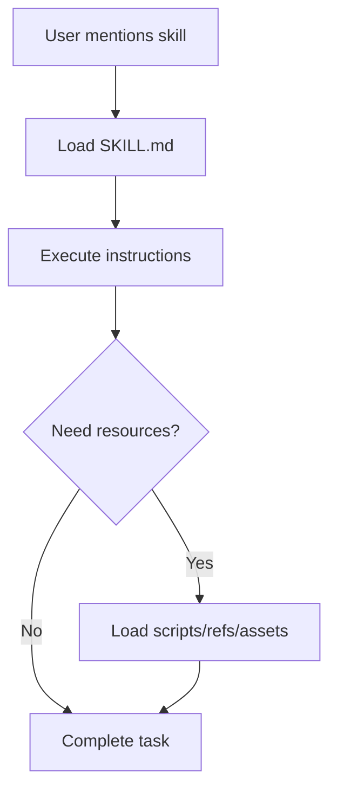

# Section 3: Skills System & Knowledge Extension

## Skills Architecture

Skills provide just-in-time specialized knowledge without bloating the context window.

### Progressive Disclosure Model



## Creating Custom Skills

### Basic Skill Structure
```
my-skill/
├── SKILL.md          # Core instructions (required)
├── scripts/          # Executable code (optional)
├── references/       # Documentation (optional)
└── assets/           # Templates (optional)
```

### Example: API Testing Skill

````markdown
---
name: api-testing
description: Generate comprehensive API tests
allowed-tools: Read, Write, Bash
model: sonnet
---

# API Testing Skill

Generate production-ready API tests with:

## Test Coverage
- Happy path scenarios
- Error handling (4xx, 5xx)
- Edge cases
- Authentication/authorization
- Rate limiting
- Input validation

## Example Test Template

```javascript
describe('POST /api/users', () => {
  it('should create user with valid data', async () => {
    const response = await request(app)
      .post('/api/users')
      .send({ email: 'test@example.com', name: 'Test' })
      .expect(201);
    
    expect(response.body).toHaveProperty('id');
  });

  it('should return 400 with invalid email', async () => {
    await request(app)
      .post('/api/users')
      .send({ email: 'invalid', name: 'Test' })
      .expect(400);
  });
});
```
````

### Installation
```bash
# Package skill
zip -r api-testing.zip my-skill/

# Install
claude /skills install api-testing.zip

# Use
claude "Use api-testing skill to generate tests for @src/routes/users.js"
```

## Skills Composition

### Combining Multiple Skills
```bash
# Use multiple skills in sequence
claude "
1. Use api-testing skill to generate tests
2. Use security-review skill to check for vulnerabilities
3. Use documentation-generator skill to create API docs
For @src/routes/payments.js"
```

## Domain-Specific Skills

### Frontend Skill Example
```markdown
---
name: react-component
description: Generate React components with TypeScript and tests
---

# React Component Generator

Creates production-ready components with:
- TypeScript types
- Props validation
- Hooks for state management
- Styled components / Tailwind CSS
- Unit tests (Jest + Testing Library)
- Storybook stories
- Accessibility (ARIA labels)
```

### Backend Skill Example
```markdown
---
name: express-api
description: Generate Express API endpoints
---

# Express API Generator

Creates endpoints with:
- Input validation (Zod)
- Error handling middleware
- OpenAPI documentation
- Service layer separation
- Database operations (with transactions)
- Integration tests
```

## Context7 as a Dynamic Skill Alternative

While traditional skills provide static, pre-defined knowledge, **Context7** offers dynamic, always-current library documentation.

### Skills vs Context7: When to Use Each

| Aspect | Traditional Skills | Context7 |
|--------|-------------------|----------|
| **Knowledge type** | Custom patterns, conventions | Library/framework docs |
| **Update frequency** | Manual (you update) | Automatic (real-time) |
| **Use case** | Company-specific patterns | Public library knowledge |
| **Best for** | Internal conventions | Latest framework features |
| **Example** | "Use our auth pattern" | "Latest Next.js patterns" |

### Using Context7 Instead of Skills

**Before: Creating a Static Skill**
```bash
# Create skill for Next.js patterns (quickly outdated)
cat > nextjs-skill/SKILL.md << 'EOF'
# Next.js Patterns
Use these Next.js patterns:
- getServerSideProps for SSR
- getStaticProps for SSG
# ...but these may be outdated in months
EOF
```

**After: Use Context7 (Always Current)**
```bash
# No skill needed - query Context7 directly
claude "Context7: Next.js 15 server components data fetching patterns"

# Context7 provides current, version-specific guidance
# No maintenance needed - always up-to-date
```

### When to Use Each

**✅ Use Context7 when:**
- Working with public libraries/frameworks
- Framework has version-specific differences (Next.js 13 vs 15)
- Library updates frequently (React, Vue, AWS SDK)
- Need latest best practices
- Checking for deprecations

**✅ Create custom Skills when:**
- Company-specific patterns and conventions
- Internal APIs and services
- Custom tooling and workflows
- Team coding standards
- Proprietary logic

### Hybrid Approach: Skills + Context7

Combine both for maximum power:

```bash
# Use skill for company conventions + Context7 for latest library patterns
claude "Using Context7 Next.js 15 patterns and our @company-api-patterns skill, 
create user authentication endpoint"
```

**Example workflow:**
1. **Context7** provides latest Next.js 15 server actions patterns
2. **Company skill** provides your specific:
   - Error handling conventions
   - Database connection patterns
   - Logging requirements
   - Security checks

### Building Skills That Leverage Context7

Create skills that **use** Context7 for staying current:

````markdown
---
name: modern-react-component
description: Generate React components using latest patterns
---

# Modern React Component Generator

## Instructions

1. Query Context7 for latest React patterns:
   - "Context7: React [current-version] component patterns"
   - "Context7: React [current-version] hooks best practices"

2. Generate component with:
   - Latest hook patterns from Context7
   - Our company TypeScript conventions
   - Our testing standards

3. Include Context7-verified patterns for:
   - State management
   - Effect handling
   - Performance optimization
````

### Examples by Domain

**Frontend Development**
```bash
# Instead of creating React/Vue/Svelte skills
claude "Context7: React 19 use() hook for data fetching"
claude "Context7: Vue 3.4 composition API patterns"
```

**Backend Development**
```bash
# Instead of framework-specific skills
claude "Context7: NestJS 10 microservices setup"
claude "Context7: Fastify v4 async hooks"
```

**Database & ORM**
```bash
# Instead of ORM skills
claude "Context7: Prisma 5 multi-schema support"
claude "Context7: Drizzle ORM migration syntax"
```

### Decision Matrix

**Choose Static Skills when:**
- ✅ Codifying company-specific knowledge
- ✅ Complex multi-step workflows
- ✅ Need offline access
- ✅ Internal tools and processes
- ✅ Custom patterns not in public docs

**Choose Context7 when:**
- ✅ Need latest public documentation
- ✅ Working with recently updated frameworks
- ✅ Version-specific library knowledge
- ✅ Official best practices
- ✅ Quick access without setup

**Use Both Together when:**
- ✅ Building with modern frameworks + company patterns
- ✅ Need latest knowledge + internal conventions
- ✅ Creating adaptive, future-proof skills
- ✅ Onboarding to both public libs and internal tools

## Team Skills Repository

### Shared Skills Setup
```bash
# Create team skills repo
mkdir company-skills
cd company-skills

# Add skills
mkdir -p skills/{company-standards,security-checklist,deployment-guide}

# Version control
git init
git add .
git commit -m "Initial skills"
git remote add origin git@github.com:company/claude-skills.git
git push

# Team members install
claude /plugin marketplace add git@github.com:company/claude-skills.git
```

### Summary

**Static Skills** = Your custom knowledge (internal, static, controlled)  
**Context7** = Public documentation (external, dynamic, always current)  
**Together** = Powerful combination of latest frameworks + your patterns

**Rule of thumb:**
- If it's on npm/public → use Context7
- If it's internal/proprietary → create a skill
- For best results → combine both

---

[← Back: Agent SDK](02-agent-sdk) | [Part 3 Complete! → Part 4](../../04-enterprise-devops-patterns)

