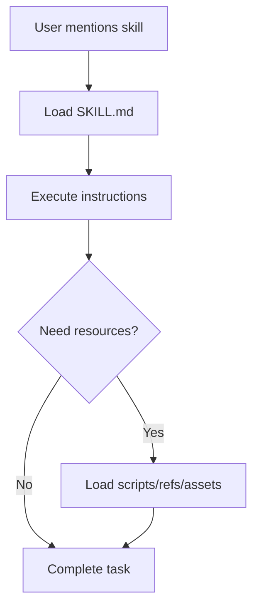

# Section 10: Skills System & Knowledge Extension

## Skills Architecture

Skills provide just-in-time specialized knowledge without bloating the context window.

### Progressive Disclosure Model



## Creating Custom Skills

### Basic Skill Structure
```
my-skill/
├── SKILL.md          # Core instructions (required)
├── scripts/          # Executable code (optional)
├── references/       # Documentation (optional)
└── assets/           # Templates (optional)
```

### Example: API Testing Skill

````markdown
---
name: api-testing
description: Generate comprehensive API tests
allowed-tools: Read, Write, Bash
model: sonnet
---

# API Testing Skill

Generate production-ready API tests with:

## Test Coverage
- Happy path scenarios
- Error handling (4xx, 5xx)
- Edge cases
- Authentication/authorization
- Rate limiting
- Input validation

## Example Test Template

```javascript
describe('POST /api/users', () => {
  it('should create user with valid data', async () => {
    const response = await request(app)
      .post('/api/users')
      .send({ email: 'test@example.com', name: 'Test' })
      .expect(201);
    
    expect(response.body).toHaveProperty('id');
  });

  it('should return 400 with invalid email', async () => {
    await request(app)
      .post('/api/users')
      .send({ email: 'invalid', name: 'Test' })
      .expect(400);
  });
});
```
````

### Installation
```bash
# Package skill
zip -r api-testing.zip my-skill/

# Install
claude /skills install api-testing.zip

# Use
claude "Use api-testing skill to generate tests for @src/routes/users.js"
```

## Skills Composition

### Combining Multiple Skills
```bash
# Use multiple skills in sequence
claude "
1. Use api-testing skill to generate tests
2. Use security-review skill to check for vulnerabilities
3. Use documentation-generator skill to create API docs
For @src/routes/payments.js"
```

## Domain-Specific Skills

### Frontend Skill Example
```markdown
---
name: react-component
description: Generate React components with TypeScript and tests
---

# React Component Generator

Creates production-ready components with:
- TypeScript types
- Props validation
- Hooks for state management
- Styled components / Tailwind CSS
- Unit tests (Jest + Testing Library)
- Storybook stories
- Accessibility (ARIA labels)
```

### Backend Skill Example
```markdown
---
name: express-api
description: Generate Express API endpoints
---

# Express API Generator

Creates endpoints with:
- Input validation (Zod)
- Error handling middleware
- OpenAPI documentation
- Service layer separation
- Database operations (with transactions)
- Integration tests
```

## Team Skills Repository

### Shared Skills Setup
```bash
# Create team skills repo
mkdir company-skills
cd company-skills

# Add skills
mkdir -p skills/company-standards
mkdir -p skills/security-checklist
mkdir -p skills/deployment-guide

# Version control
git init
git add .
git commit -m "Initial skills"
git remote add origin git@github.com:company/claude-skills.git
git push

# Team members install
claude /plugin marketplace add git@github.com:company/claude-skills.git
```

[← Back: Agent SDK](09-agent-sdk) | [Part 3 Complete! → Part 4](../../docs/04-enterprise-devops-patterns)


