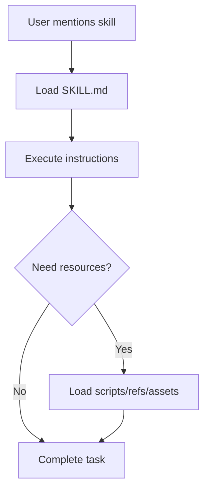

# Section 10: Skills System & Knowledge Extension

## Skills Architecture

Skills provide just-in-time specialized knowledge without bloating the context window.

### Progressive Disclosure Model



## Creating Custom Skills

### Basic Skill Structure
```
my-skill/
├── SKILL.md          # Core instructions (required)
├── scripts/          # Executable code (optional)
├── references/       # Documentation (optional)
└── assets/           # Templates (optional)
```

### Example: API Testing Skill

````markdown
---
name: api-testing
description: Generate comprehensive API tests
allowed-tools: Read, Write, Bash
model: sonnet
---

# API Testing Skill

Generate production-ready API tests with:

## Test Coverage
- Happy path scenarios
- Error handling (4xx, 5xx)
- Edge cases
- Authentication/authorization
- Rate limiting
- Input validation

## Example Test Template

```javascript
describe('POST /api/users', () => {
  it('should create user with valid data', async () => {
    const response = await request(app)
      .post('/api/users')
      .send({ email: 'test@example.com', name: 'Test' })
      .expect(201);
    
    expect(response.body).toHaveProperty('id');
  });

  it('should return 400 with invalid email', async () => {
    await request(app)
      .post('/api/users')
      .send({ email: 'invalid', name: 'Test' })
      .expect(400);
  });
});
```
````

### Installation
```bash
# Package skill
zip -r api-testing.zip my-skill/

# Install
claude /skills install api-testing.zip

# Use
claude "Use api-testing skill to generate tests for @src/routes/users.js"
```

## Skills Composition

### Combining Multiple Skills
```bash
# Use multiple skills in sequence
claude "
1. Use api-testing skill to generate tests
2. Use security-review skill to check for vulnerabilities
3. Use documentation-generator skill to create API docs
For @src/routes/payments.js"
```

## Domain-Specific Skills

### Frontend Skill Example
```markdown
---
name: react-component
description: Generate React components with TypeScript and tests
---

# React Component Generator

Creates production-ready components with:
- TypeScript types
- Props validation
- Hooks for state management
- Styled components / Tailwind CSS
- Unit tests (Jest + Testing Library)
- Storybook stories
- Accessibility (ARIA labels)
```

### Backend Skill Example
```markdown
---
name: express-api
description: Generate Express API endpoints
---

# Express API Generator

Creates endpoints with:
- Input validation (Zod)
- Error handling middleware
- OpenAPI documentation
- Service layer separation
- Database operations (with transactions)
- Integration tests
```

## Team Skills Repository

### Shared Skills Setup
```bash
# Create team skills repo
mkdir company-skills
cd company-skills

# Add skills
mkdir -p skills/company-standards
mkdir -p skills/security-checklist
mkdir -p skills/deployment-guide

# Version control
git init
git add .
git commit -m "Initial skills"
git remote add origin git@github.com:company/claude-skills.git
git push

# Team members install
claude /plugin marketplace add git@github.com:company/claude-skills.git
```

---

## Context7: Dynamic Alternative to Static Skills

While skills provide static, packaged knowledge, **Context7** offers dynamic, always-up-to-date documentation access. Understanding when to use each is important.

### Skills vs Context7: Comparison

| Aspect | Static Skills | Context7 |
|--------|--------------|----------|
| **Update frequency** | Manual (when you update skill) | Automatic (real-time docs) |
| **Content** | Custom patterns, internal tools | Public library documentation |
| **Use case** | Company-specific patterns | Framework/library knowledge |
| **Setup** | Create + package + distribute | Just mention in prompt |
| **Version control** | Git repository | N/A (always latest) |
| **Offline** | Works offline | Requires API access |
| **Customization** | Full control | Uses official docs |
| **Maintenance** | You maintain | Anthropic maintains |

### When to Use Skills

✅ **Create custom skills for:**
- **Company-specific patterns**: "Use our API design skill"
- **Internal tools**: "Use deployment-to-staging skill"
- **Proprietary processes**: "Use security-review-checklist skill"
- **Team conventions**: "Use code-style-guide skill"
- **Complex multi-step workflows**: "Use feature-release skill"

**Example: Internal API Skill**
```bash
# Your company's specific API patterns
claude "Use company-api-patterns skill to create new user endpoint"

# Skill includes:
# - Your error handling conventions
# - Your authentication patterns
# - Your database transaction patterns
# - Your logging standards
```

### When to Use Context7

✅ **Use Context7 for:**
- **Public framework documentation**: "Context7: Next.js 15 patterns"
- **Library APIs**: "Context7: Prisma 5 advanced queries"
- **Recently updated docs**: "Context7: React 19 new hooks"
- **Version-specific guidance**: "Context7: AWS CDK v3 constructs"
- **Official best practices**: "Context7: TypeScript 5.4 features"

**Example: Framework Knowledge**
```bash
# Get latest Next.js patterns
claude "Context7: Next.js 15 server actions authentication"

# Context7 fetches:
# - Official Next.js docs
# - Current best practices
# - Version-specific examples
# - Latest API changes
```

### Hybrid Approach: Skills + Context7

Combine both for maximum effectiveness:

```bash
# Use Context7 for framework knowledge + custom skill for company patterns

claude "Using Context7 Next.js 15 patterns and our @company-api-patterns skill, 
create user authentication endpoint in src/app/api/auth/"
```

**Example workflow:**
1. **Context7** provides latest Next.js 15 server actions patterns
2. **Company skill** provides your specific:
   - Error handling conventions
   - Database connection patterns
   - Logging requirements
   - Security checks

### Creating Skills That Reference Context7

You can create skills that explicitly use Context7 for staying current:

````markdown
---
name: modern-react-components
description: Create React components using latest patterns
---

# Modern React Component Skill

When creating React components:

1. Query Context7 for latest React version patterns
2. Apply company styling conventions
3. Include TypeScript types
4. Add Storybook stories

## Template

```typescript
// Query Context7 for latest React hooks
// Use company @styles/theme
// Follow @company-typescript-patterns

export const ComponentName: React.FC<Props> = ({ ...props }) => {
  // Implementation using latest React patterns from Context7
};
```
````

**Usage:**
```bash
claude "Use modern-react-components skill to create UserProfile component"

# Skill will:
# 1. Query Context7 for React 19 patterns
# 2. Apply your company styles
# 3. Generate TypeScript types
# 4. Create Storybook file
```

### Best Practices: Combining Skills and Context7

#### Pattern 1: Context7 for Foundation, Skills for Customization

```bash
# Context7 provides framework baseline
# Skill provides your customizations

claude "Context7: Next.js 15 app router setup
Then apply @company-nextjs-config skill for our environment variables, 
monitoring, and error tracking setup"
```

#### Pattern 2: Skills Reference Context7

**Create adaptive skills** that query Context7:

```markdown
# In your skill SKILL.md

When creating new features:
1. Query Context7 for latest [framework] patterns
2. Apply patterns from this skill
3. Follow company conventions in references/conventions.md
```

#### Pattern 3: Regular Skill Updates from Context7

Keep your skills current by periodically updating them with Context7 knowledge:

```bash
# Monthly: Update skills with latest patterns
claude "Context7: Get latest Next.js 15 best practices for:
- Data fetching
- Authentication
- Error handling

Update our @company-nextjs skill with these patterns"
```

### Decision Matrix

**Choose Static Skills when:**
- ✅ Codifying company-specific knowledge
- ✅ Complex multi-step workflows
- ✅ Need offline access
- ✅ Internal tools and processes
- ✅ Custom patterns not in public docs

**Choose Context7 when:**
- ✅ Need latest public documentation
- ✅ Working with recently updated frameworks
- ✅ Version-specific library knowledge
- ✅ Official best practices
- ✅ Quick access without setup

**Use Both Together when:**
- ✅ Building with modern frameworks + company patterns
- ✅ Need latest knowledge + internal conventions
- ✅ Creating adaptive, future-proof skills
- ✅ Onboarding to both public libs and internal tools

### Example: Real-World Hybrid Usage

**Scenario**: Building new Next.js 15 feature with company standards

```bash
# Step 1: Get latest framework patterns (Context7)
claude "Context7: Next.js 15 app router server actions best practices"

# Step 2: Apply company patterns (Skills)
claude "Using Context7 Next.js 15 patterns and @company-standards skill:
1. Create user registration endpoint
2. Follow our error handling conventions
3. Use our logging standards
4. Add our monitoring hooks"

# Result:
# - Modern Next.js 15 code (via Context7)
# - Your company's patterns (via skill)
# - Best of both worlds
```

### Summary

**Static Skills** = Your custom knowledge (internal, static, controlled)  
**Context7** = Public documentation (external, dynamic, always current)  
**Together** = Powerful combination of latest frameworks + your patterns

**Rule of thumb:**
- If it's on npm/public → use Context7
- If it's internal/proprietary → create a skill
- For best results → combine both

---

[← Back: Agent SDK](09-agent-sdk) | [Part 3 Complete! → Part 4](../../docs/04-enterprise-devops-patterns)


