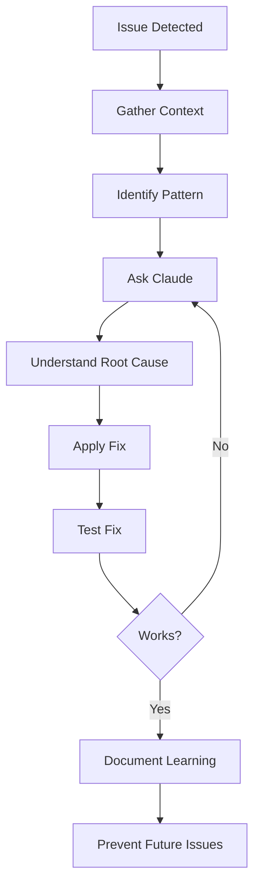

# Section 02: Debugging Patterns

**Quick debugging workflows and patterns using Claude Code for common development issues.**

**What You'll Learn:**
- Pattern-based debugging approach
- Common issue categories and solutions
- Effective debugging prompts
- Time-saving debugging workflows

**Average time savings:** 10-30x faster than traditional debugging

Tool/API/extension issues: [Troubleshooting](../07-reference-troubleshooting/02-troubleshooting).

---

## Table of Contents

1. [Common Debugging Patterns](#common-debugging-patterns)
2. [Pattern Application Guide](#pattern-application-guide)
3. [Quick Reference Prompts](#quick-reference-prompts)
4. [Debugging Workflow](#debugging-workflow)

---

## Common Debugging Patterns

### Pattern 1: Unhandled Async Errors

**Symptom:** API returns 500 errors intermittently with no logs

**Root Cause:** Promise rejections in async Express routes bypass error middleware

**Solution Pattern:**
```typescript
// Add try-catch to async handlers
router.post('/endpoint', async (req, res, next) => {
  try {
    // Your code
  } catch (error) {
    next(error); // Pass to error middleware
  }
});

// Or use express-async-errors globally
require('express-async-errors');
```

**Claude Prompt:**
```bash
git diff | claude "What promise rejections are unhandled? Suggest error handling."
```

**Key Learning:** Always wrap async Express handlers or use express-async-errors

---

### Pattern 2: React Infinite Re-renders

**Symptom:** "Maximum update depth exceeded" error, browser freezes

**Root Cause:** useEffect depends on state it updates, creating infinite loop

**Solution Pattern:**
```typescript
// ❌ Wrong: Effect updates user, depends on user
useEffect(() => {
  fetchUser().then(data => setUser(data));
}, [user]); // Infinite loop!

// ✅ Correct: Don't depend on state you're updating
useEffect(() => {
  fetchUser().then(data => setUser(data));
}, []); // Run once on mount
```

**Claude Prompt:**
```bash
claude "Why does this React component re-render infinitely?" --files="src/components/MyComponent.tsx"
```

**Key Learning:** Never put state in deps array if the effect updates that state

---

### Pattern 3: TypeScript Type Recursion

**Symptom:** "Type instantiation is excessively deep and possibly infinite"

**Root Cause:** Circular generic types (A<B> where B contains A<C>)

**Solution Pattern:**
```typescript
// ❌ Wrong: Circular type reference
type ApiResponse<T> = {
  data: T;
  meta: { next?: ApiResponse<any> }; // Circular!
};

// ✅ Correct: Break circularity
type ApiResponse<T> = {
  data: T;
  meta: { nextUrl?: string }; // Use URL, not nested type
};
```

**Claude Prompt:**
```bash
npm run build 2>&1 | claude "Explain this TypeScript error in simple terms"
```

**Key Learning:** Avoid circular generic types; use IDs/URLs for relationships

---

### Pattern 4: N+1 Query Problem

**Symptom:** API endpoint suddenly 40x slower after refactor

**Root Cause:** Loop making one database query per item instead of JOIN

**Solution Pattern:**
```typescript
// ❌ Wrong: N+1 queries (1 + N separate queries)
const posts = await prisma.post.findMany();
for (const post of posts) {
  post.author = await prisma.user.findUnique({ where: { id: post.authorId }});
}

// ✅ Correct: Single JOIN query
const posts = await prisma.post.findMany({
  include: { author: true } // Single query with JOIN
});
```

**Claude Prompt:**
```bash
git diff main -- src/ | claude "What performance anti-patterns did this introduce?"
```

Full list: [Anti-Patterns](../07-reference-troubleshooting/04-antipatterns).

**Key Learning:** Always use `include` for relations; avoid loops with queries

---

### Pattern 5: Flaky Tests in CI

**Symptom:** Test passes locally, fails randomly in CI (30% failure rate)

**Root Cause:** Using synchronous queries for async content

**Solution Pattern:**
```typescript
// ❌ Wrong: getByText is synchronous
const element = screen.getByText('Loaded Data'); // Fails if not loaded yet

// ✅ Correct: findByText waits for async content
const element = await screen.findByText('Loaded Data'); // Waits up to 1000ms
```

**Claude Prompt:**
```bash
claude "Why is this test flaky in CI but passes locally?" --files="src/**/*.test.ts"
```

**Key Learning:** Use `findBy*` for async content, never `setTimeout` in tests

---

### Pattern 6: Memory Leaks

**Symptom:** Memory grows from 100MB → 2GB over 24 hours, then crashes

**Root Cause:** Not removing items from Maps/Sets when connections close

**Solution Pattern:**
```typescript
// ❌ Wrong: Never removes disconnected clients
const clients = new Map();
ws.on('connection', (ws, req) => {
  clients.set(userId, ws);
  ws.on('close', () => {
    console.log('disconnected'); // But never removes from Map!
  });
});

// ✅ Correct: Remove from Map on disconnect
ws.on('close', () => {
  clients.delete(connectionId); // Clean up
});
```

**Claude Prompt:**
```bash
claude "What memory leaks exist? Check Maps, listeners, timers." --files="src/server.ts"
```

**Key Learning:** Always clean up Maps, event listeners, and timers

---

### Pattern 7: CORS Issues in Production

**Symptom:** API works locally, fails in production with CORS error

**Root Cause:** Hardcoded localhost origin doesn't match production domain

**Solution Pattern:**
```typescript
// ❌ Wrong: Hardcoded localhost
app.use(cors({ origin: 'http://localhost:3000' }));

// ✅ Correct: Environment-based origins
const allowedOrigins = process.env.ALLOWED_ORIGINS?.split(',') || ['http://localhost:3000'];
app.use(cors({
  origin: (origin, callback) => {
    if (!origin || allowedOrigins.includes(origin)) {
      callback(null, true);
    } else {
      callback(new Error('Not allowed by CORS'));
    }
  },
  credentials: true
}));
```

**Claude Prompt:**
```bash
claude "CORS failing in production but works locally. Check configuration:" \
  --files="backend/src/app.ts frontend/src/api/"
```

**Key Learning:** Use environment variables for origins, never hardcode

---

## Pattern Application Guide

### Step 1: Identify Pattern Category

| Symptoms | Pattern Category |
|----------|-----------------|
| 500 errors, no logs | Async error handling |
| UI freezes, max depth error | React re-renders |
| Build fails, type errors | TypeScript issues |
| Sudden slowness after change | Performance regression |
| Works locally, fails in CI | Environment differences |
| Memory grows over time | Memory leaks |
| Works locally, fails in prod | Configuration issues |

### Step 2: Apply Claude Pattern

```bash
# Gather context
git diff [base] | claude "[Pattern-specific prompt]" --files="[relevant-files]"

# Claude identifies:
# - Root cause
# - Why it manifests this way
# - Specific fix with code
# - Related issues to check

# Apply fix
# Test fix
# Document learning
```

### Step 3: Verify Solution

```bash
# For performance issues
git diff main | claude "Compare performance characteristics before/after"

# For functionality issues
npm test 2>&1 | claude "Verify fix addresses root cause"

# For production issues
claude "What could go wrong with this fix in production?" --files="[fixed-files]"
```

---

## Quick Reference Prompts

### By Issue Type

```bash
# Async/Promise issues
git diff | claude "What promise rejections are unhandled? Suggest error handling."

# Performance regression
git diff main -- src/ | claude "What performance anti-patterns did this introduce?"

# React issues
claude "Why does this component re-render infinitely?" --files="src/components/*.tsx"

# Type errors
npm run build 2>&1 | claude "Explain this TypeScript error and suggest fix"

# Test flakiness
claude "Why is this test flaky in CI?" --files="src/**/*.test.ts"

# Memory leaks
claude "What memory leaks exist? Check Maps, listeners, timers." --files="src/server.ts"

# CORS/Config issues
claude "Why does this work locally but fail in production?" \
  --files="backend/ frontend/config/"

# General debugging
npm test 2>&1 | claude "Debug failures - explain root cause and fix"
```

### By Workflow Stage

```bash
# Before committing (catch issues early)
git diff --cached | claude "Review for common bugs: async errors, N+1, memory leaks"

# After test failure
npm test 2>&1 | claude "Explain failures and suggest fixes"

# Performance investigation
claude "Profile this code for performance issues" --files="src/slow-endpoint.ts"

# Production incident
claude "Analyze this error log and suggest fix" < error.log
```

---

## Debugging Workflow

### Effective Debugging Process



### 1. Gather Context (1-2 min)

```bash
# Collect relevant information
- Error messages
- Stack traces
- Recent changes: git diff main
- Relevant files
- Environment differences
```

### 2. Ask Claude (30 sec)

```bash
# Provide full context in one prompt
[error output] | claude "[Specific question about the pattern]" \
  --files="[relevant-files]"

# Be specific:
# ✅ "What's the race condition causing this infinite loop?"
# ❌ "Fix my code"
```

### 3. Understand Root Cause (2-5 min)

- Read Claude's explanation of **why** (not just **what**)
- Ask follow-up questions for clarity
- Verify the explanation matches your symptoms

### 4. Apply & Test Fix (5-10 min)

```bash
# Apply fix
# Test thoroughly
# Check for related issues Claude mentioned
```

### 5. Document Learning (1-2 min)

```bash
# Add to team knowledge base
# Update code review checklist
# Add preventive check to CI
```

**Total time:** 10-20 minutes (vs 2-4 hours traditional debugging)

---

## Key Debugging Principles

### 1. Claude Explains "Why", Not Just "What"

Traditional tools show **what** is broken. Claude explains:
- **Why** it's broken
- **How** the bug manifests
- **Why** the fix works
- **What else** to check

### 2. Patterns Over Memorization

You don't need to memorize every bug type. Recognize the pattern category, then ask Claude for specifics.

### 3. Iterative Refinement

Don't expect one-shot solutions:
1. Ask initial question
2. Get analysis
3. Ask follow-up for clarity
4. Get deeper insight
5. Apply understanding

### 4. Prevention > Cure

After fixing, ask Claude:
- "What else should I check?"
- "How do I prevent this?"
- "What monitoring should I add?"

### 5. Learn While Debugging

Each debugging session teaches concepts:
- Async error handling patterns
- React effect dependencies
- TypeScript type systems
- Database query optimization
- Testing best practices
- Memory management
- Configuration management

---

## Time Savings Summary

| Pattern | Traditional | With Claude | Speedup |
|---------|------------|-------------|---------|
| Async errors | 2-4 hours | 8 min | 15-30x |
| React re-renders | 1-2 hours | 5 min | 12-24x |
| Type recursion | 2-3 hours | 12 min | 10-15x |
| N+1 queries | 2-4 hours | 15 min | 8-16x |
| Flaky tests | 3-5 hours | 10 min | 18-30x |
| Memory leaks | 4-8 hours | 25 min | 10-20x |
| CORS issues | 1-3 hours | 7 min | 9-26x |
| **Average** | **2-4 hours** | **12 min** | **10-30x** |

**Cost:** $0.03-0.12 per debugging session

**ROI:** Even at 1 bug per week: 2-4 hours saved = $200-400 value for $0.50 cost

---

## When to Use Claude vs Traditional Tools

### Use Claude When:
- ✅ Need to understand "why"
- ✅ Cryptic error messages
- ✅ Pattern recognition (seen this before?)
- ✅ Multiple possible causes
- ✅ Need to learn while fixing

### Use Traditional Tools When:
- ✅ Need exact execution trace
- ✅ Performance profiling with metrics
- ✅ Memory heap analysis
- ✅ Network request inspection
- ✅ Step-by-step debugging

### Best Approach: Combine Both
1. Use profiler/debugger to identify **what** is slow/broken
2. Use Claude to understand **why** and **how to fix**
3. Use traditional tools to verify fix

---

## Summary

**Key Takeaways:**

1. **Recognize patterns** - Most bugs fall into 7 common categories
2. **Ask specific questions** - "What's the race condition?" not "Fix my code"
3. **Understand root causes** - Learn why, not just what
4. **Apply iteratively** - Follow up for clarity
5. **Prevent recurrence** - Ask about related issues

**Expected Results:**
- 10-30x faster debugging
- Deeper understanding of root causes
- Prevention of similar future bugs
- Team learning from each session

**Next Steps:**
1. Bookmark quick reference prompts
2. Try pattern-based approach on next bug
3. Share learnings with team
4. Build team debugging prompt library

---

[← Back to Part 6](README.md) | [Next: Team Adoption →](03-team-adoption.md)
